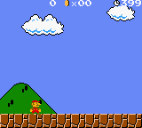

# PyBrosAI

PyBrosAI is a [PyTorch](https://pytorch.org/) reinforcement-learning project
for Super Mario Bros. Deluxe using [PyBoy](https://github.com/Baekalfen/PyBoy).
The main agent is a recurrent PPO policy
using interaction tiles, stacked observations, route-memory features, and
level-aware rewards.

**This project is entirely vibe-coded. This README is proofread, but everything else is of unknown quality**




## Setup

Use a legally obtained Super Mario Bros. Deluxe ROM:

```sh
python3 -m venv .venv
source .venv/bin/activate
python -m pip install --upgrade pip
python -m pip install -r requirements.txt
```

## Train

```sh
python ppo_train.py \
  --rom /path/to/SuperMarioBrosDeluxe.gbc \
  --device cuda \
  --checkpoint checkpoints/mario_deluxe_recurrent_ppo_v18.pt
```

The default trainer uses twelve emulator workers, recurrent PPO, and the
configured multi-level curriculum. Use `--help` for rollout, level, and
evaluation options.

## Demo

Run a trained PPO checkpoint in an SDL2 window:

```sh
python ppo_demo.py --demo-steps 1500 \
  --rom /path/to/SuperMarioBrosDeluxe.gbc \
  --checkpoint checkpoints/mario_deluxe_recurrent_ppo_v18.best.pt
```

## Deployment

The Docker image installs PyBoy and runs the CUDA PPO trainer. Put
the ROM at `roms/Super Mario Bros. Deluxe.gbc`, then deploy to the configured
GPU host:

```sh
./deploy/sync_and_deploy.sh linode_gpu
```

The script preserves remote `roms/` and `checkpoints/`, rebuilds the image,
and recreates the trainer. Set `FOLLOW_LOGS=1` to follow training output.

## Current state

- `mario_env.py`: Gymnasium environment, startup synchronization, progress
  normalization, route memory, object features, and explicit hole-failure
  termination.
- `ppo.py` and `ppo_train.py`: recurrent PPO model, rollout/update logic,
  curriculum training, and greedy/stochastic evaluation.
- `ppo_demo.py`: PPO playback with optional GIF capture.
- `route_memory.py`: episode-local camera-aware route observations.

The tracked v18 checkpoint is the current training and demo baseline.
